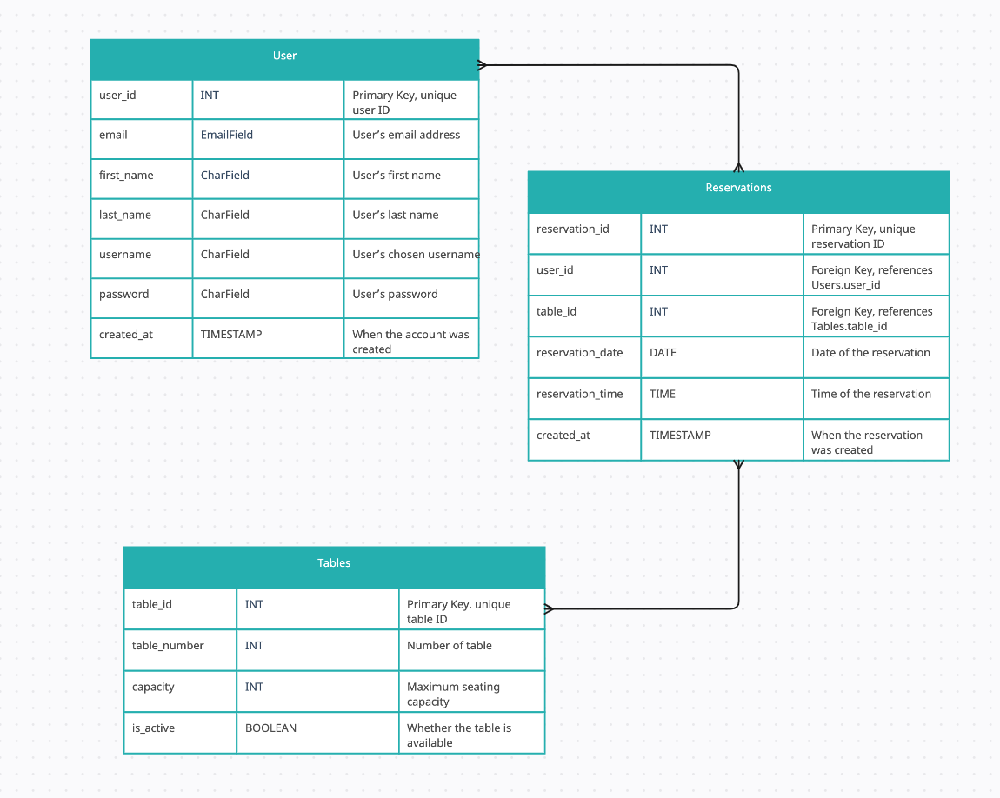

# Welcome to Dar Tangier

View the live project here

Dar Tangier is a Moroccan-themed, responsive restaurant website with registration and table booking system for customers. Created as a fourth Project Portfolio for Code Institute.

# Table of Contents
UX
Agile Development
Features Implemented
Features Left to Implement
Technology Used
Testing
Bugs
Deployment
Resources
Credits and Acknowledgements

# UX

## Database planning

After defining the project goals and the core features I wanted to include, I used Creately to outline the database structure visually. This initial database schema serves as a foundational guide, showcasing the types of data entities and how they relate to one another. The diagram provides a clear layout of the primary tables, including Users, Reservations, and Tables, along with the key relationships between them.

This structure not only assists in understanding data flow and connections but also offers a blueprint for implementing and expanding on the project’s database as development progresse

# Agile Development

# Features Implemented

# Technology Used

# Testing

# Deployment

# Ressources

# Credits and Acknowledgement