# Welcome to Dar Tangier

View the live project here

Dar Tangier is a Moroccan-themed, responsive restaurant website with a registration and reservation system for customers to book tables, view the menu, and get in touch with the restaurant. This project was developed as part of the Code Institute's fourth Project Portfolio

# Table of Contents
1. [UX](#ux)
2. [Agile Development](#agile-development)
3. [Features Implemented](#features-implemented)
4. [Technology Used](#technology-used)
5. [Testing](#testing)
6. [Bugs](#bugs)
7. [Deployment](#deployment)
8. [Credits and Acknowledgements](#credits-and-acknowledgement)

# UX

## Goals and Target Audience
Dar Tangier is designed for food enthusiasts, locals, and tourists looking to experience authentic Moroccan cuisine in Munich. The website provides essential features for easy reservation and navigation, suitable for individuals, families, and groups looking to dine at Dar Tangier. 

## Design 
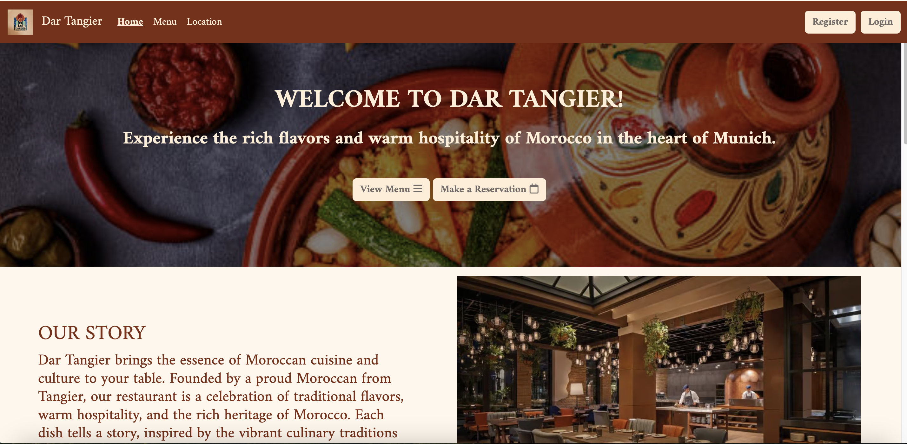
The Dar Tangier website embraces a color palette inspired by traditional Moroccan decor, with warm and inviting tones that reflect the ambiance of the restaurant:

- Mahogany and Sand: Rich shades of mahogany and warm sand tones are used as primary colors, 
evoking the earthy warmth and sophistication associated with Moroccan architecture and interior design.
- Accents of Deep Orange and Gold: These accents are used sparingly to highlight call-to-action buttons, enhancing user navigation while fitting the Moroccan theme of hospitality and vibrancy.
- Ivory and Off-White Backgrounds: These tones provide a clean and welcoming background that contrasts beautifully with the deeper colors, ensuring readability and a visually pleasing experience.

This color scheme not only aligns with Moroccan aesthetics but also helps create an inviting, elegant atmosphere for users exploring the restaurant’s offerings and making reservations.

## Database planning
## Initial data structure
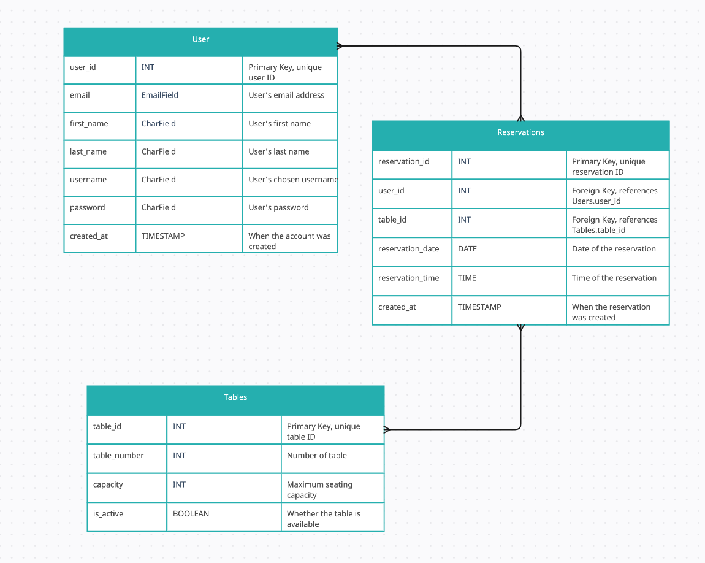
After defining the project goals and the core features I wanted to include, I used Creately to outline the database structure visually. This initial database schema serves as a foundational guide, showcasing the types of data entities and how they relate to one another. The diagram provides a clear layout of the primary tables, including Users, Reservations, and Tables, along with the key relationships between them.

This structure not only assists in understanding data flow and connections but also offers a blueprint for implementing and expanding on the project’s database as development progresse.

## Final data structure
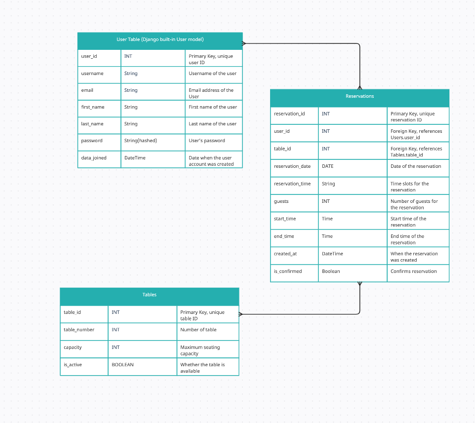
After refining the project and finalizing essential featured, I adjusted the initial database schema to accommodate specific requirements for user management, reservation scheduling, and table availability. Using Creately, I visually outlined the final data structure, focussing on theUser, Table, and Reservation tables, and their relationships. 

## Wireframes
To plan the layout and functionality of each page, wireframes were created with [Balsamiq](https://balsamiq.com/) as visual guides for the user interface.
These wirframes helped outline essential elements and streamline the design process by providing a clear structure for key components like the homepage, menu, reservation system and User profile Management on different screen sizes. 

### Large and medium screens
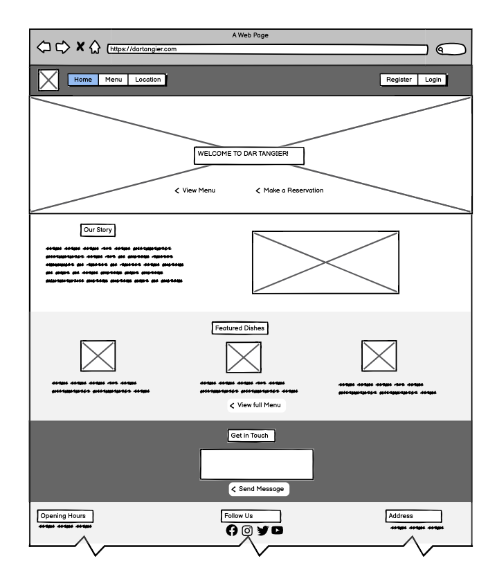

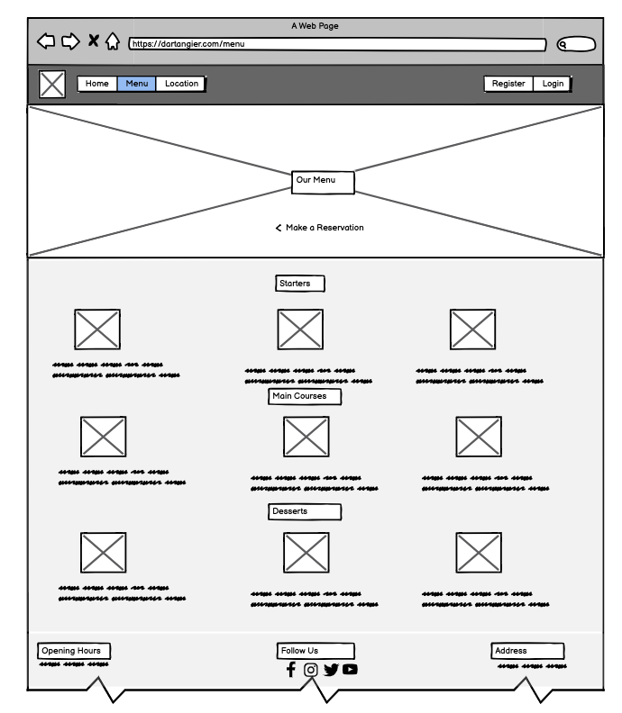

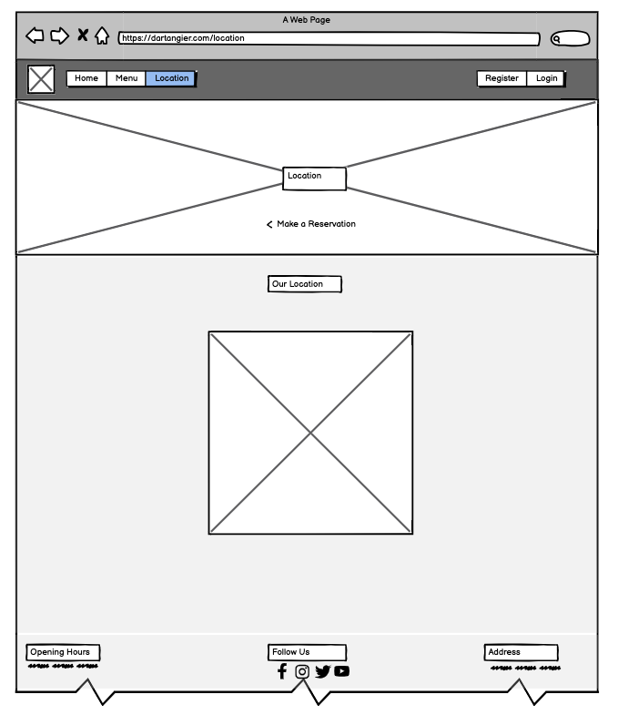

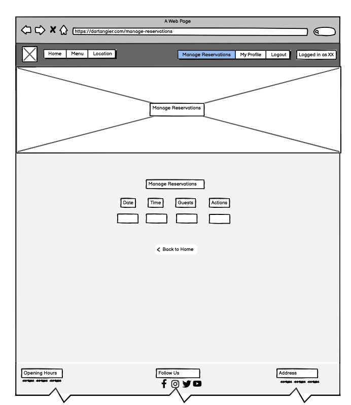

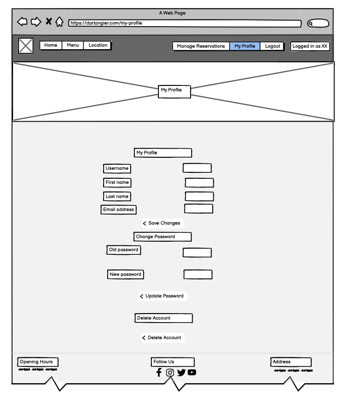


### Small screens

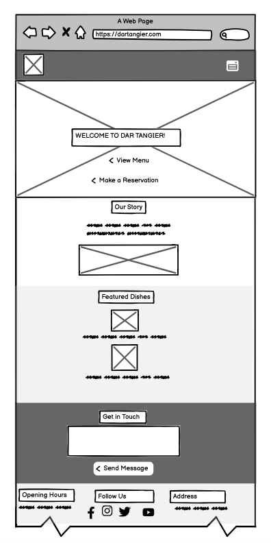

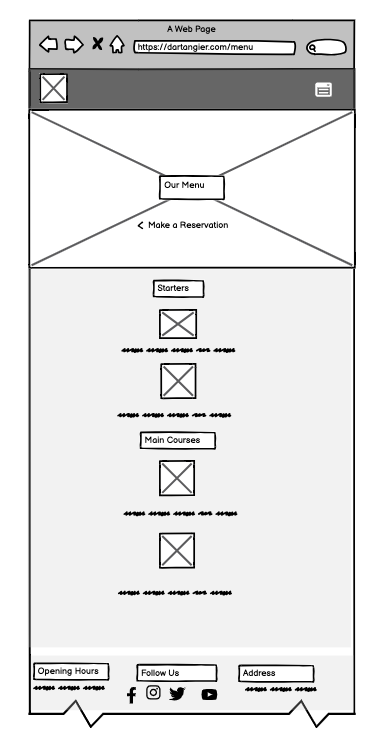

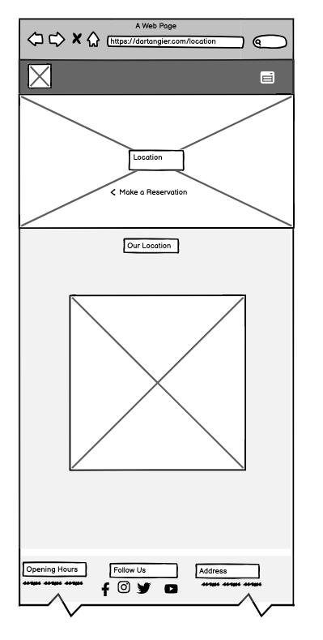

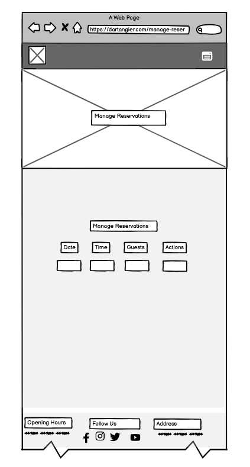

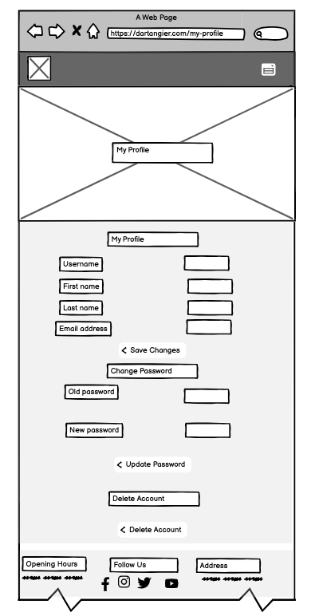


# Agile Development
## Overview
This project followed Agile methodology with iterative development cycles, feature prioritization, and task tracking. Development tasks were organized and tracked with GiHub Projects, which ensured the timely delivery of essenntial functionalities. Each spring was dedicated to the development and refinement of specific feature sets, including the homepage design, menu display, user registration, and reservation management. 

I initiated this project with a clear intent to streamline workflow and effectively manage the expected workload. After outlining the major epics, I systematically decomposed them into actionable user stories and smaller tasks. This approach not only enhanced my ability to monitor progress, but also served as a motivational framework to complete the project on schedule. In addition to the user stories, I created distinct issues for each module of the README.md file, further clarifying objectives and ensuring all components were addressed. 

For a comprehensive overview of the project's progress and workflow, please refer to [this Kanban page](https://github.com/users/BilalEssafi1/projects/2)

## User Stories
To kickstart the project, I adopted a user-centric approach. By envisioning myself as a potential user, I identified key features and functionalities that would enhance the website's usability and appeal. I then translated these insights into a set of user stories, prioritizing core features that would provide a solid foundation for the website. 

Each user story was broken down into smaller, actionable tasks, allowing for a structured and efficient development process. As I progressed through the development phase, I tracked my progress and documented any challenges or solutions encountered. This approach ensured a transparent and organized development workflow. 

By prioritizing user needs and following an agile methodology, I aimed to deliver a high-quality website that meets the expectations of both users and stakeholders. 

### List of User Stories
1. [User Story: Home Page](https://github.com/BilalEssafi1/dar-tangier-project/issues/15)
2. [User Story: Admin Panel](https://github.com/BilalEssafi1/dar-tangier-project/issues/22)
3. [User Story: Sign-Up for Account](https://github.com/BilalEssafi1/dar-tangier-project/issues/16)
4. [User Story: Sign-In to Account](https://github.com/BilalEssafi1/dar-tangier-project/issues/17)
5. [User Story: Manage Reservations](https://github.com/BilalEssafi1/dar-tangier-project/issues/18)
6. [User Story: Delete Account](https://github.com/BilalEssafi1/dar-tangier-project/issues/19)
7. [User Story: Forgot Password](https://github.com/BilalEssafi1/dar-tangier-project/issues/20)
8. [User Story: Manage User Information](https://github.com/BilalEssafi1/dar-tangier-project/issues/21)


# Features Implemented

## Homepage
- Navbar: User-friendly navigation bar is present on all pages and it adapts to the user's authentication status (logged in or not.) Logged-in users have access to profile and reservation management features. 
- Home Page: Displays a visually appealing hero image, well-organized content like Introduction, Featured Dishes and Contact Form. 
- Footer: Displays essential information such as contact details, social media links, and opening hours. 

## User Registration and Profile
- Account Creation: Users can register to make reservations.
- Profile Management: Users can update profile details and change passwords.
- Account Deletion: Option to delete account with confirmation prompts.

## Reservations
- Booking Form: Allows users to select date, time, and guest count.
- Reservation Success and Management: Users receive confirmation and can manage reservations via their profile.
- Table Availability: System checks for available tables and confirms reservation.

## Menu
- Dish Categories: Starters, main courses, and desserts with descriptions and pricing.

## Location
- Map Integration: Uses Google Maps to show the restaurant’s location.

## Responsive Design
The website is mobile-friendly and responsive across all devices, optimized with Bootstrap for consistent styling.

## Future Feature ideas
- Enhanced Reservation Notifications: Email reminders or SMS for confirmed reservations.
- Menu Management for Admin: Allow admin users to update the menu dynamically.
- Table Availability Display: Real-time display of available tables before booking.


# Technology Used
- Frontend: HTML, CSS, JavaScript, Bootstrap
- Backend: Django, Python
- Database: PostgreSQL (configured for production via DATABASE_URL)
- Deployment: Deployed on Heroku, with dj_database_url for database handling.
- Other: Google Maps API, Font Awesome for icons, and Crispy Forms for Django form styling.

# Testing

## Responsiveness 


# Manual testing

| Test Case | Action | Expectation | Pass/Fail |
| --- | --- | --- | --- |
| Contact Form Submission and EmailJS | This was tested by filling out the "Get in Touch" form with valid information, submitting it, and then checking if the email arrived in the Dar Tangier inbox.| The user receives a confirmation alert upon submission, and the Dar Tangier inbox receives an email containing the message details. | Pass | 
| Gallery Carousel | Tested by clicking the "View" button and navigating through the gallery. | A pop-up window opens with the gallery and includes functional "Next" and "Previous" buttons. | Pass | 
| Navigation | Tested by licking nav links and checking that the user ends up on the correct landing page. | User is redirected to the correct landing page | Pass | 
|  | |  |  | 

# Bugs

## Solved Bugs
- The "Get in Touch" form allowed empty message submissions, as users could submit the form with whitespace in the textarea field. To resolve this, I added JavaScript validation that checks for non-empty content, preventing form submission if the field is blank. This solution ensures users provide an input before the form can be submitted.
- The Google Maps API wasn't displaying correctly because I didn't use consistent naming. In urls.py, I referenced the wrong view (views-location instead of views.location_view), and the environment variable was incorrectly named GOOGLE_MAPS_API_KEY instead of GOOGLE_API_KEY. Fixing these to be consistent resolved the issue. Additionally, I forgot to add the Google API key in Heroku under Settings -> Config Vars to ensure it works correctly on the deployed website.
- The reservation success page wasn't displaying correctly due to inconsistent URL pattern naming. In the make_reservation view, I was using redirect('reservation-success') with a hyphen, but in urls.py the pattern was named 'reservation_success' with an underscore. Changing the redirect to use consistent underscore naming (reservation_success) resolved the NoReverseMatch error and fixed the redirection after making a reservation.


## Known Bugs


# Deployment

## Steps for Deploying a Django Application on Heroku
1. Create the Heroku App
- Sign Up or Log In to Heroku:
    - Go to the Heroku website (https://www.heroku.com/) and either sign up for a new account or log into your existing account.
- Create a New App:
    - On the Heroku dashboard, click the “New” button, then select “Create New App”.
    - Enter a unique name for your application (for example, "Django Cafe App"). Remember, the name must be unique across all Heroku apps.
    - Choose the region where you want to deploy your app; typically, you’d select the one closest to your target audience (like EU or US).
    - Click “Create App” to finalize the process.

- Configure Deployment Method:
    - Navigate to the "Deploy" tab within your new app's dashboard.
    - Select “GitHub” as your deployment method.
    - Connect your GitHub account to Heroku if prompted. This allows Heroku to access your repositories.
    - Find your repository from the list and connect it.

2. Set Up Environment Variables
- Create Environment Variables in Your Django Project:
    - In your Django project directory, create a file named env.py at the root level.
    - Inside env.py, import the os module. Set up necessary environment variables as follows:
    ```
    import os
    os.environ['SECRET_KEY'] = 'your-unique-secret-key'
    os.environ['DATABASE_URL'] = 'your-database-url'
    ```

- Update settings.py:
    - Open your settings.py file and modify it to use the environment variables:
        - Replace the existing SECRET_KEY line with:
        ```
        SECRET_KEY = os.environ.get('SECRET_KEY')
        ```
        - For the database configuration, use dj_database_url to parse the DATABASE_URL:
        ```
        import dj_database_url
        DATABASES = {
        'default': dj_database_url.parse(os.environ.get('DATABASE_URL'))
        }
        ```
3. Add Required Imports:
- At the top of your settings.py, add the necessary imports:
```
from pathlib import Path
import os
import dj_database_url
if os.path.isfile('env.py'):
    import env
```
4. Set Environment Variables in Heroku:
- In your Heroku app dashboard, go to the “Settings” tab and click on “Reveal Config Vars”.
- Add the DATABASE_URL and SECRET_KEY keys with their respective values.
3. Configure Static Files and Templates
- Static Files Settings:
    - In settings.py, configure your static files settings as follows:
    ```
    STATIC_URL = '/static/'
    STATICFILES_DIRS = [os.path.join(BASE_DIR, 'static')]
    STATIC_ROOT = os.path.join(BASE_DIR, 'staticfiles')
    ```
-  Templates Directory:
    - Set up the templates directory:
    ```
    TEMPLATES_DIR = os.path.join(BASE_DIR, 'templates')
    ```
    - Modify the TEMPLATES setting to include the new directory:
    ```
    TEMPLATES = [
        {
            'BACKEND': 'django.template.backends.django.DjangoTemplates',
            'DIRS': [TEMPLATES_DIR],
            ...
        },
    ]
    ```
- Allowed Hosts:
    - In settings.py, update the ALLOWED_HOSTS list to include your Heroku app URL:
        ```
        ALLOWED_HOSTS = ['your-app-name.herokuapp.com']
         ````

- Create Required Directories:
    - In your project structure, create two new folders at the top level: static and templates, to hold your static files and HTML templates, respectively.

4. Create a Procfile
- Setting Up the Procfile:
    - In the root directory of your Django project, create a file named Procfile (with a capital "P").
    - Inside the Procfile, add the following line to specify how to run your application:
    ```
    web: gunicorn your_project_name.wsgi
    ```

5. Migrate Database Models
- Open your terminal and run the migrations to apply your models to the new PostgreSQL database:
```
python manage.py migrate
```
6. Push Changes to GitHub
- Stage, commit, and push your changes to the GitHub repository:
```
git add .
git commit -m "Configured deployment settings for Heroku"
git push origin main
```

7. Deploy the Application
- Deploy on Heroku:
    - Go back to the Heroku dashboard, navigate to the "Deploy" tab, and manually trigger a deployment of your branch.
    - Monitor the build log for any errors during the build process.
- Check Deployment Status:
    - If the deployment is successful, Heroku will display a message indicating that your app has been deployed, along with a link to your live application.

- Troubleshooting:
    - If your initial builds fail (common issues might include incorrect static file configuration or misnamed directories), review the error messages, make the necessary code adjustments, and redeploy.

## Forking and Cloning a GitHub Repository
- How to Fork this Project:
    1. Login to [GitHub](https://github.com/).
    2. Navigate to the repository: https://github.com/BilalEssafi1/dar-tangier-project.
    3. Click on the Fork button in the top-right corner.  
    4. Select Create a new fork.

- How to Clone this Project:
    1. Login to [GitHub](https://github.com/).
    2. Go to the repository: Login to https://github.com/BilalEssafi1/dar-tangier-project.
    3. Click the green Code button.
    4. Under the Clone section, choose the method to clone the repository (HTTPS, SSH, or GitHub CLI).
    5. Open the terminal in your code editor
    - Use the cd command to navigate to the directory where you want to clone the repository.
    6. Run the git clone command followed by the repository URL you copied, and press Enter. 


# Credits and Acknowledgement

This project benefited from various resources, tutorials, and creative assets, helping shape Dar Tangier’s functionality and visual appeal:
- Code and Structure Inspiration:
    - [Code Institute's Whiskey Drop Project](https://github.com/Code-Institute-Solutions/BootstrappingYourNextBigIdea-BS4): Provided a foundational structure for organizing the project.
    - Code Innstitute's I Think Therefore I Blog Project: Used as a guide for initial Django setup and deployment.

- Images and Visual Assets:
    - [Leonardo AI](https://leonardo.ai/): Used to create the Dar Tangier logo.
    - Freepik and iStock:
        - Couscous Dish: [Freepik](https://de.freepik.com/premium-ki-bild/marokkanisches-couscous-gericht_52159730.htm)
        - Moroccan Pastilla: [iStock](https://www.istockphoto.com/de/foto/frische-marokkanische-pastilla-gm141206983-19535897)
        - Chicken Tajine: [Eat.de](https://eat.de/rezept/haehnchen-tajine-mit-gemuese/) 
        - Hummus: [Freepik](https://www.freepik.com/premium-ai-image/moroccan-spiced-carrot-hummus_154993129.htm)
        - Zaalouk: [iStock](https://www.istockphoto.com/de/search/2/image-film?page=2&phrase=zaalouk)
        - Moroccan Salad: [Freepik](https://www.freepik.com/premium-photo/traditional-moroccan-salad-with-onions-tomatoes-cucumber_31927142.htm)
        - Mint Tea: [Freepik](https://www.freepik.com/premium-ai-image/moroccan-mint-tea-traditional-arabic-drink-from-morocco-traditional-refreshing-moroccan-drink_148078288.htm)
    - Restaurant and Hero Images:
        - Hero Image: [Explore Worldwide](https://www.exploreworldwide.eu/holidays/a-taste-of-morocco-imperial-cities-and-deserts)
        - Restaurant Image: [Mandarin Oriental](https://eattravel.de/mandarin-oriental-muscat-eroeffnung/), [American Express Travel](https://www.americanexpress.com/en-gb/travel/discover/property/Oman/Muscat/Mandarin-Oriental-Muscat), and [Hulutrip](http://m.hulutrip.com/news/201612/1046338.html)

- Frontend Development Resources:
    - Full-Width Background Image Guide: CSS Tricks’ [Perfect Full Page Background Image](https://css-tricks.com/perfect-full-page-background-image/)
    - jQuery CDN: jQuery resources via [releases.jquery.com](https://releases.jquery.com/)

- Code, Django and API Integrations:
    - Allauth Quickstart Guide: Referenced for user authentication setup in Django, based on Allauth documentation.
    - [Cat Beans Café Project by Tula Unogi](https://github.com/TulaUnogi/cat-beans-cafe): Provided inspiration for the reservation management functionality and the readme structure. Note: while based on this project, all code was thoroughly modified to meet the specific needs and use case of Dar Tangier.
    - Google Maps API Integration: Followed a [YouTube tutorial](https://www.youtube.com/watch?v=2LvwNMgW4vw) on Google Maps integration by Google Maps API tutorial.
